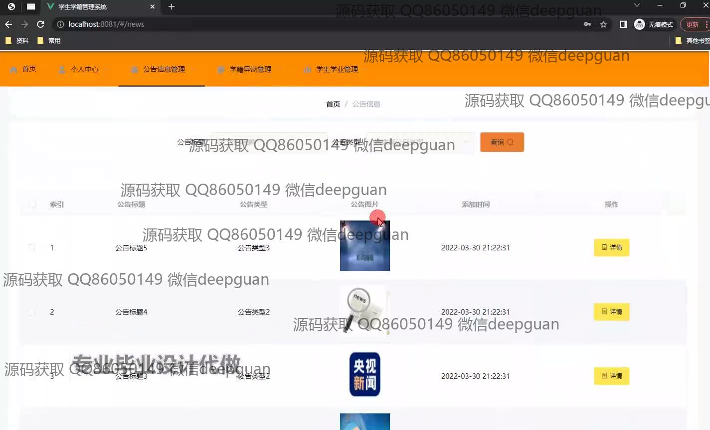
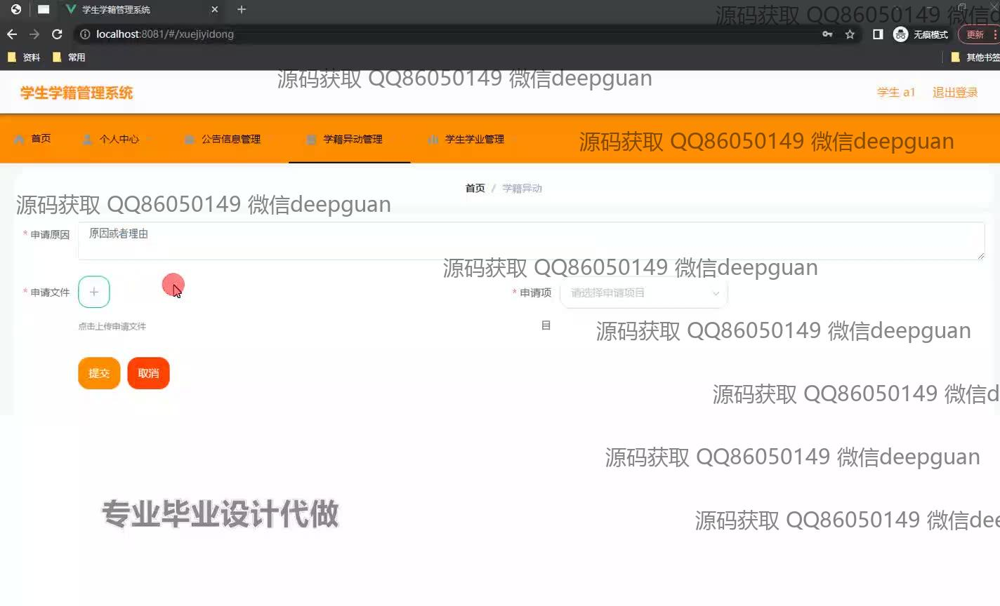
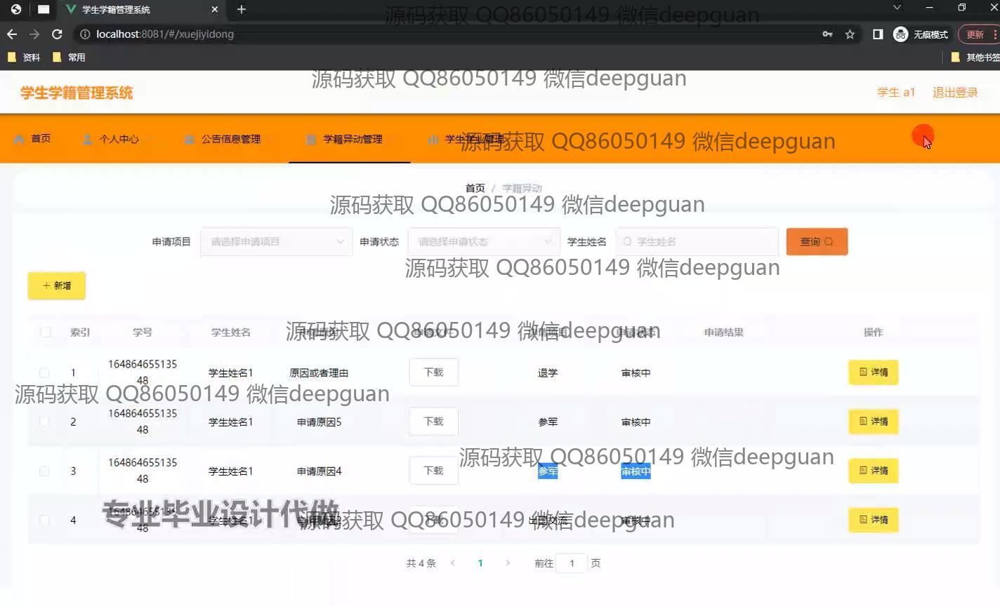
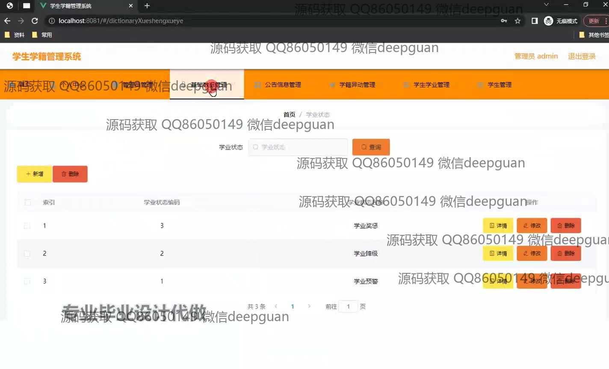
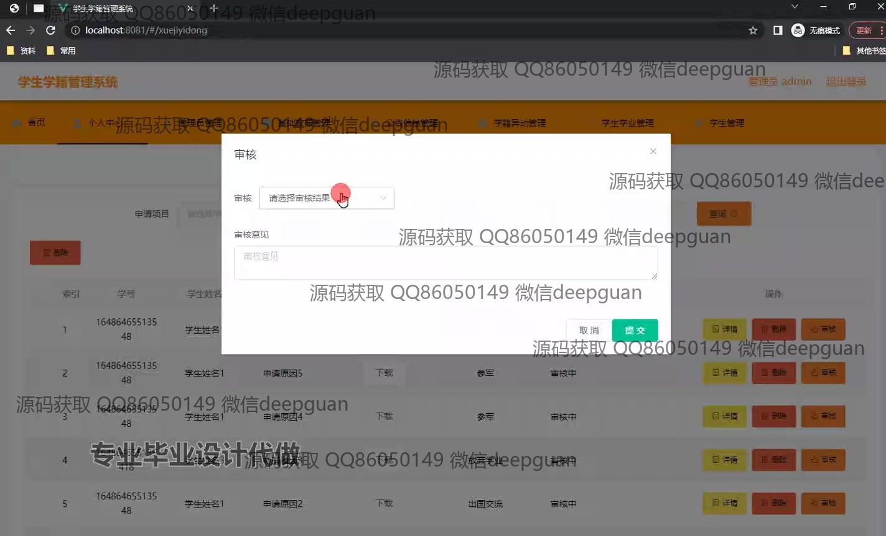
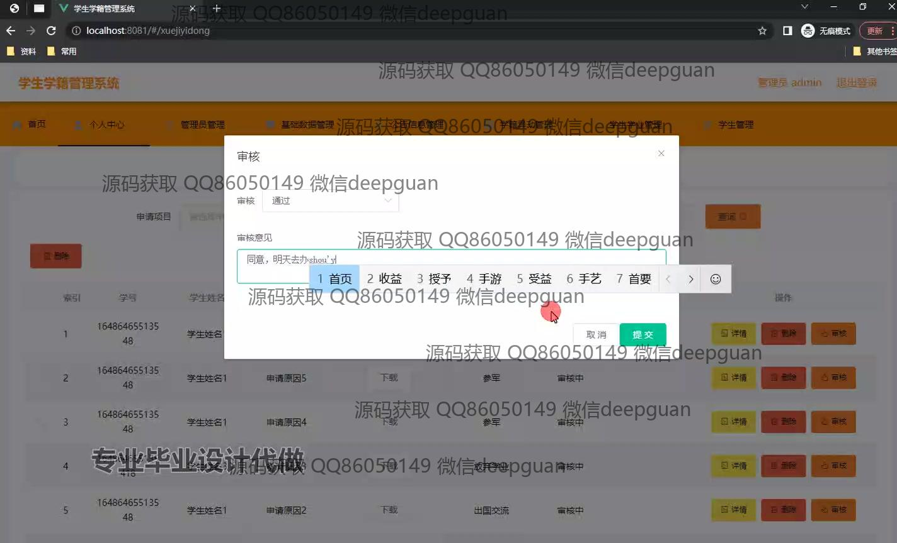
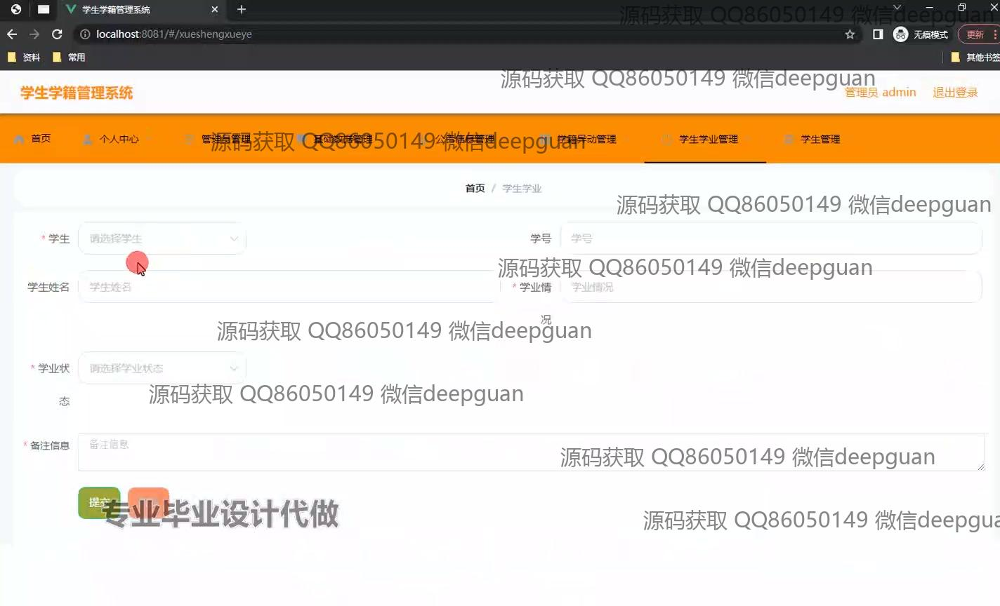
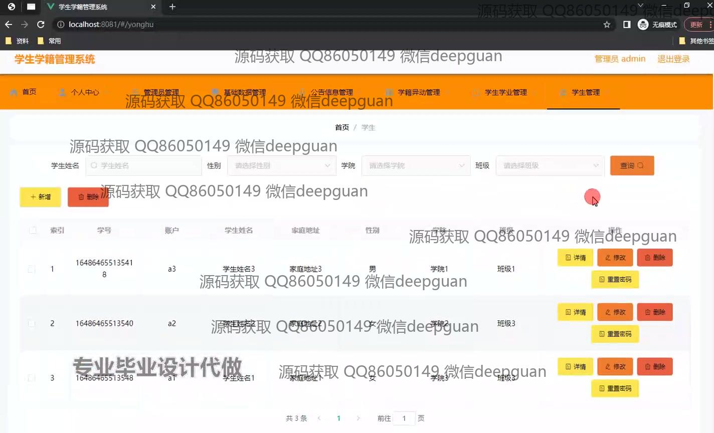

<h1 align="center">学生学籍管理系统设计与实现+vue</h1>

## 简介
学生学籍管理系统：角色分为管理员和用户；功能包括学籍异动管理、公告信息管理、学业管理、基础数据管理、信息查询与审批模块。    --计算机毕业设计源码；毕设源码；java毕业设计源码

## 联系方式

<h3 align="center">获取完整代码与数据库文件 + 微信：deepguan QQ: 86050149 QQ群: 783742310</h3>

<h3 align="center">可帮忙远程部署 包运行成功！提供远程部署、修改代码、设计文档指导、代码讲解等服务！</h3>

## 功能介绍（完整见运行截图）
管理员： 学生信息管理功能包括查询、修改、删除和重置密码，支持按姓名、性别、学院和班级进行筛选。系统内提供多个管理模块，如管理员管理、基础数据管理和公告信息管理，便于更新和维护网站数据。支持管理公告信息列表，用户可查看详情及增删改功能。此外，系统支持审核学生申请，输入审核意见，并提交审核结果。

学生： 可通过系统提交学籍异动申请，需输入申请项目、申请原因，并上传相关文件。表单中红星标记为必填项，通过提交按钮完成操作。学生可在异动管理模块查看申请状态和详情，支持下载申请文件。学业管理模块允许学生查看个人学业状态，并与管理员沟通申请事宜。

## 运行截图

本代码来源于网络,仅供学习参考使用!

